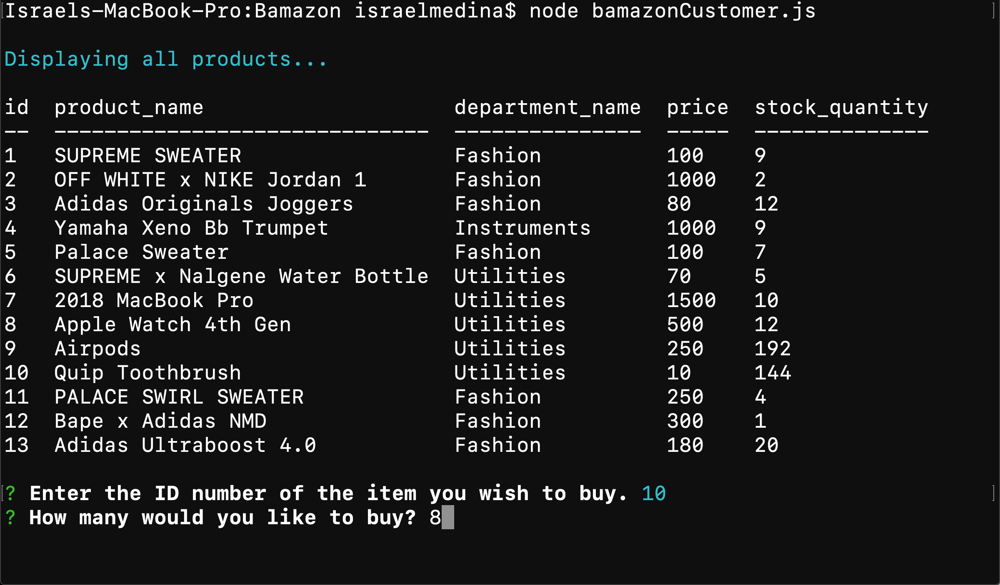
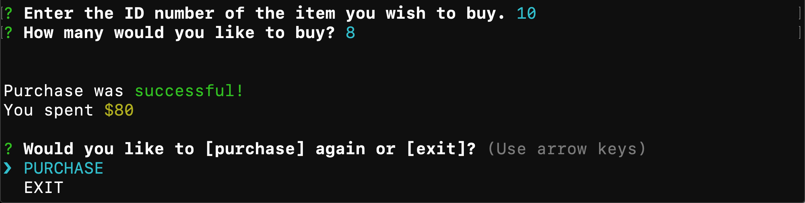
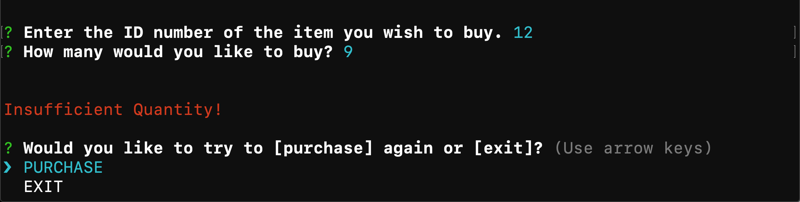
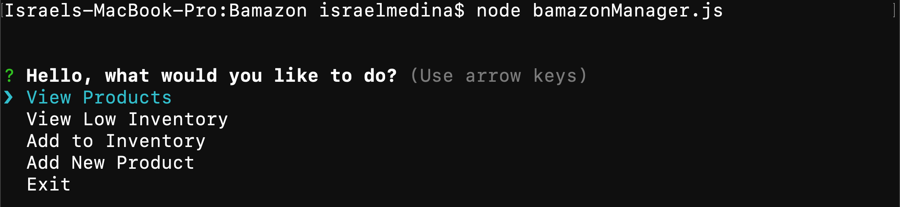
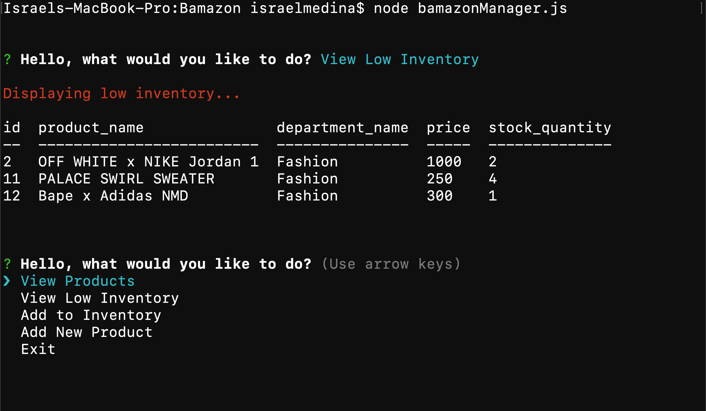

# Bamazon
Bamazon is an "Amazon" counter part that simulates what it is like to be a customer and what it's like to be a manager. 

## Bamazon Customer
The customer portion allows the user to see a series of items for sale along with their 

* Department
* Price
* Amount in stock

As soon as the program opens, we make a connection to the databse.

```javascript
//make a connection to the database
var connection = mysql.createConnection({
    host: "localhost",

    port: ###,

    user: "****",

    password: "",
    database: ""
});

//when we connect
connection.connect(function(err) {
    if (err) throw err;

    //run the show items function
    showItems();
})
```

The function ```showItems()``` is there to automatically generate each item that is in the database, helping the cutsomer identify the items they wish to buy.

```javascript
//show items function to render items in the database
function showItems() {
    console.log(chalk.cyan("\nDisplaying all products...\n"));
    //connect to the databse with a query to select all items
    connection.query("SELECT * FROM products", function(err, res) {
        if (err) throw err;

        //render the results in a formatted table
        console.table(res);
        //callback to our menu function
        menu();
    })

}
```

Next, I run a function called ```menu()``` that starts an inquirer to see what the user would like to purchase.

```javascript
 //inquirer asks for specific information
 inquirer.prompt([
 {
    // The first question should ask them the ID of the product they would like to buy
    name: "id",
    message: "Enter the ID number of the item you wish to buy.",
    validate: function(value) {
        if (isNaN(value) === false) {
            return true;
        }
        return false;
    }
},
{
    // The second message should ask how many units of the product they would like to buy
    name: "quantity",
    message: "How many would you like to buy?",
    validate: function(value) {
        if (isNaN(value) === false) {
            return true;
        }
        return false;
    }
}])
```

After this, the amount they want to buy is evaluated. If the amount they wish to purchase is less than or equal to the amount in stock, the user is allowed to purchase the item. Otherwise, they are asking for too many of that item and we must display that we do not have enough to meet their request. 

Whether they made a purchase, or were told about an insuffciency, the user is asked if they would like to make another purchase or if they want to exit.





## Bamazon Manager
Bamazon manager allows the user to act as a manager for the company. In this file there are a few choices to choose from after we establish a connection to the database:

* View Products 
* View Low Inventory
* Add to Inventory 
* Add New Product 
* Exit



Each one has their own set of instructions to allow the "manager" to update the database.

#### View Products 

The view products option is similar to way ```bamazonCustomer.js``` starts. It will show all the content that is in the databse in a table structure. 


#### View Low Inventory 

This option is very helpful to managers. It will connect to the databse and only select items from the databse where an item has less than 5 items in stock. 

```javascript
function viewLowInventory() {
    console.log(chalk.red("\nDisplaying low inventory...\n"));
    connection.query("SELECT * FROM products WHERE stock_quantity < 5", function (err, res) {
        if (err) throw err;

        console.table(res);
        menu();
    })

}
```

The items appear in a clean, easy to read format that allow the manager to quickly identify which items are low in stock. 



Also, after each function, the user is asked what they would like to do next through inquirer.

#### Add to Inventory 

#### Add New Product 

#### Exit 

